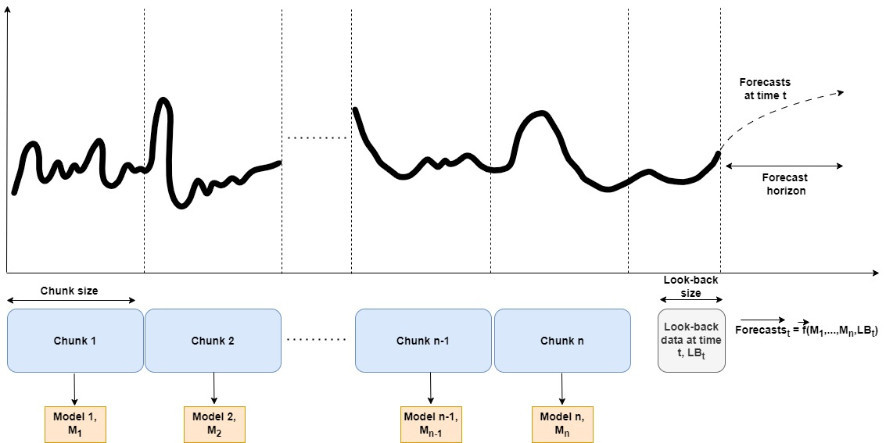
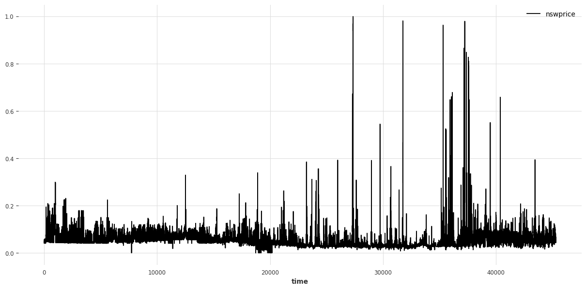
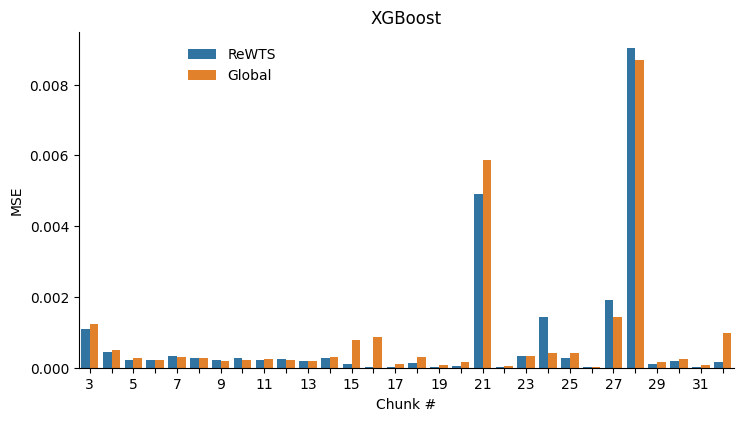
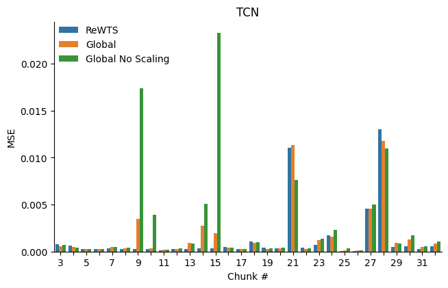
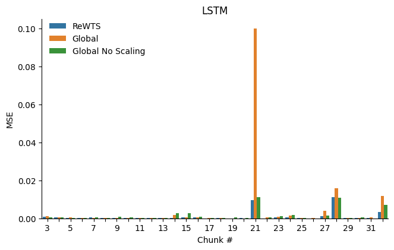
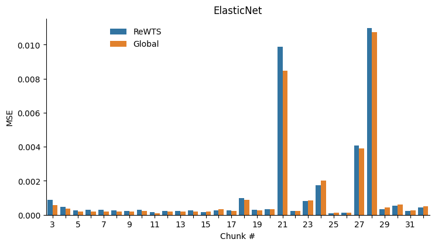

<div align="center">

# Recency-Weighted Temporally-Segmented Ensemble for Time-Series Modeling

</div>

## Description

Time-series modeling in process industries faces the challenge of dealing with complex, multi-faceted, and evolving data characteristics. Conventional single model approaches often struggle to capture the interplay of diverse dynamics, resulting in suboptimal forecasts. Addressing this, we introduce the Recency-Weighted Temporally-Segmented (ReWTS, pronounced 'roots') ensemble model, a novel chunk-based approach for multi-step forecasting. The key characteristics of the ReWTS model are twofold: 1) It facilitates specialization of models into different dynamics by segmenting the training data into \`chunks' of data and training one model per chunk. 2) During inference, an optimization procedure assesses each model on the recent past to select the active models, such that the appropriate mixture of previously learned dynamics can be recalled to forecast the future.



## Table of Contents

- [How to Run](#how-to-run)
  - [Training](#training)
  - [Evaluation](#evaluation)
  - [Hyperparameter Optimization](#hyperparameter-optimization)
  - [Using Your Own Dataset](#using-your-own-dataset)
- [Process Data Experiments](#process-data-experiments)
  - [Training and Evaluation](#training-and-evaluation)
  - [Example Results](#electricity-results)
- [Synthetic Dataset - Sine Experiment](#synthetic-dataset---sine-experiment)

<br>

## How to Run

Install dependencies

```bash
# [OPTIONAL] create conda environment or venv
conda create -n rewts python=3.10
conda activate rewts

# install pytorch according to instructions.
# https://pytorch.org/get-started/

# install requirements
pip install -r requirements.txt

# [OPTIONAL] if you cloned the repository to a slurm cluster,
# run the script below to automatically submit jobs through slurm
bash scripts/configure_slurm.sh
```

### Training

To train an ensemble of models, use the [configs/experiment/ensemble.yaml](configs/experiment/ensemble.yaml) config:

```bash
python src/train.py -m experiment=ensemble
```

Note here the -m flag (--multirun) as we will be training multiple models. This call will train models independently as outlined above, one for each data chunk, which can then be used together in an ensemble. To train one corresponding global model on all data to use as a baseline against the ensemble models, use the [configs/experiment/global.yaml](configs/experiment/global.yaml) config:

```bash
python src/train.py experiment=global
```

To train global models on progressively cumulating chunks, use the [configs/experiment/global_iterative.yaml](configs/experiment/global_iterative.yaml) config:

```bash
python src/train.py -m experiment=global_iterative
```

Note that you can change the configuration, either by editing the files in the [configs](configs) directory or overriding on the command-line, e.g. to use the xgboost model with 20 lags and a 80/20 training/validation data split:

```bash
python src/train.py experiment=global model=xgboost model.lags=20 datamodule.train_val_test_split.train=0.8 datamodule.train_val_test_split.val=0.2
```

See [Hydra documentation](https://hydra.cc/docs/intro/) and the [tutorial document](tutorial.md) for more information.

### Evaluation

#### Ensemble

These models can then be used together as an ensemble for evaluation or prediction, by pointing the model_dir argument to the outermost log folder (i.e. not one of the 0, 1, 2, etc. folders containing each individual model, but the parent folder of these), e.g.:

```bash
python src/eval.py model_dir=logs/train/multiruns/2023-06-05_14-13-19
```

The logic to trigger an ensemble of models is that either:

1. model_dir is a comma-separated list of paths to model directories
2. model_dir points to a directory containing multiple model directories (e.g. the result of a multirun)
3. model_dir has a glob pattern which expands to multiple model directories, e.g. model_dir=logs/train/multiruns/2023-12-12_12-00-00/1\*

#### Global

The global model can be evaluated by pointing to a specific model directory, such as the inner log folder (e.g. logs/train/runs/2023-08-28_14-45-35 or logs/train/multiruns/2023-09-06_17-56-21/0)

```bash
python src/eval.py model_dir=logs/train/multiruns/2023-06-05_14-13-19/0
```

#### Specific Chunk

To evaluate the models on a specific chunk, use the [configs/experiment/chunk_eval.yaml](configs/experiment/chunk_eval.yaml) config, and specify the chunk_idx. This config defines two arguments global_model_dir and ensemble_model_dir (both expected to be the result of a multirun, e.g. running the [global_iterative.yaml](configs/experiment/global_iterative.yaml) or [ensemble.yaml](configs/experiment/ensemble.yaml) configs), and aids in selecting only the models trained on preceding chunks to evaluate the current chunk of data. For instance, to evaluate both the ensemble and a global model on chunk #6 (chunks are 0-indexed), do:

```bash
python src/eval.py -m experiment=chunk_eval datamodule.chunk_idx=5 ensemble_model_dir=path/to/ensemble global_model_dir=path/to/global model_type=ensemble,global
```

#### Multiple Chunks

To evaluate the ensemble and/or global models over a range of chunks (starting from #3 as the ensemble needs at least two models) you can use the [configs/experiment/chunk_eval_iterative.yaml](configs/experiment/chunk_eval_iterative.yaml) config. This config works similarly to the [configs/experiment/chunk_eval.yaml](configs/experiment/chunk_eval.yaml) config, except you also need to define the last chunk_idx (chunk_idx_end) to use (and optionally chunk_idx_start, by default 2):

```bash
python src/eval.py -m experiment=chunk_eval_iterative chunk_idx_end=32 ensemble_model_dir=path/to/ensemble global_model_dir=path/to/global model_type=ensemble,global
```

#### Integrated Training Evaluation Pipeline

Finally, training and evaluation can be run as an integrated pipeline with the [scripts/run_iterative_experiment.sh](scripts/run_iterative_experiment.sh) script. This script will train ensemble and global models, and then iteratively evaluate them over the data chunks. The script accepts command line overrides as described before, and the special arguments -train after which the arguments will only be used for training and -eval for which the arguments only will be used for evaluation:

```bash
bash scripts/run_iterative_experiment.sh +logger=mlflow -train model=xgboost logger.mlflow.experiment_name=training -eval logger.mlflow.experiment_name=evaluation
```

The above will train ensemble and baseline global xgboost models and enable the mlflow logger for both training and evaluation, and set the experiment name for the two parts respectively.

### Hyperparameter Optimization

Hyperparameter optimization as described in the paper can be done by making a config file at [configs/hparams_search](configs/hparams_search), and using this with the [src/train_hopt.py](src/train_hopt.py) python script. An example of hyperparamter optimization for global models can be run with:

```bash
python src/train_hopt.py hparams_search=electricity_elastic_net
```

An example for ensemble models where we also optimize the chunk_length and lookback_data_length parameters can be run with:

```bash
python src/train_hopt.py hparams_search=electricity_elastic_net_ensemble
```

The results are saved in a database at [logs/optuna/hyperopt.db](logs/optuna/hyperopt.db). You can view these results through optuna-dashboard, for instance by running:

```bash
bash scripts/run_optuna_dashboard.sh
```

### Using Your Own Dataset

To use your own dataset, you have to do two things:

1. Create a datamodule class for your dataset under [src.datamodules](src/datamodules), see [src.datamodules.electricity_datamodule.py](src/datamodules/electricity_datamodule.py).
   1. If your dataset fits an equisized chunking pattern, then you can simply subclass the [ChunkedTimeSeriesDataModule](src/datamodules/components/chunked_timeseries_datamodule.py) class. Remember to define the dataset_length (total number of datapoints in dataset), and chunk_length (number of datapoints in each chunk) arguments so that the number of chunks can be inferred.
   2. Otherwise, you have to implement the chunking logic yourself as a function of the chunk_idx argument used by the experiment configs specifying the selected chunk(s).
2. Create a .yaml config file under [configs/datamodule](configs/datamodule) that defines the default arguments of your datamodule class. See [configs/datamodule/electricity.yaml](configs/datamodule/electricity.yaml) for an example.

Also note that the dataset set to self.data at the end of the setup() function must be represented in column-format, that is, each feature of your time-series has its own column and the dataset index must be the time index of the dataset. See an integer-indexed example below:

| index (time) | variable1 | variable2 | variable3 |
| ------------ | --------- | --------- | --------- |
| 0            | 1.0       | 0.1       | 0.3       |
| 1            | 2.0       | nan       | 3.0       |
| 2            | 3.0       | 0.2       | 3.3       |

<br>

## Process Data Experiments

The main branch of this repository is under active development. The state of the code used to produce the results of the paper and the results on the electricity dataset shown below is available on the branch paper.

This section documents the experiments where process data is chunked in time. The datasets employed in the paper are not publicly available. Instead, we will illustrate the procedure using the Electricity dataset (Harries 1999), a dataset often used to evaluate machine learning models in the context of concept drift. In this sense, it is similar to the datasets employed in the paper. The dataset was downloaded from this [link](https://www.openml.org/search?type=data&sort=runs&id=151&status=active), and is included in the repository at [data/electricity-normalized.arff](data/electricity-normalized.arff)

This dataset was collected from the Australian New South Wales Electricity Market. In this market, prices are not fixed and are affected by demand and supply of the market. The dataset contains 45,312 datapoints dated from 7 May 1996 to 5 December 1998. Each datapoint of the dataset refers to a period of 30 minute. We use the New South Wales electricity price (nswprice) as the target variable, and forecast these prices 12 hours into the future.



The procedure we followed to optimize the global and ensemble forecasting models were as follows. We assumed initially you will collect some data before you start training forecasting models. Thus, we use the first 33% of the dataset to experiment and do hyperparameter optimization (HPO) using the following procedure:

1. **Experiment with chunk_length and lookback_data_length**. For instance by running HPO with the [configs/hparams_search/electricity_elastic_net_ensemble.yaml](configs/hparams_search/electricity_elastic_net_ensemble.yaml) config.
2. **Perform HPO with the chosen model architectures**. We have prepared and run configs for the four model architectures used in the paper: [tcn](configs/hparams_search/electricity_tcn.yaml), [rnn](configs/hparams_search/electricity_rnn.yaml), [xgboost](configs/hparams_search/electricity_tcn.yaml), and [elastic net](configs/hparams_search/electricity_elastic_net.yaml). In order to not bias our results in favor of the ReWTS model, we chose to do HPO with global models (i.e. training a single model on all the first 33% of the data) and then use these results as the basis for both global and ensemble models. For the neural network models, we scale down the parameter count (by changing num_filters for TCN and hidden_dim for RNN) such that each ensemble model has 1 / (num chunks in HPO data) parameters. Since we scale the number of parameters in the global model to match the ensemble, when training the global models on 0-33% of the data it will be equal in parameter count to what was identified as optimal through HPO and continue to increase from there as the size of the training set increases. We also test global models that do not scale, i.e. the always use the hyperparameters from HPO no-matter the size of the training set.
3. **Run iterative chunk evaluations using optimized hyperparameters**. We have saved the results of the HPO from step 2. in the configs at configs/model/electricity\_{[elastic_net](configs/model/electricity_elastic_net.yaml), [rnn](configs/model/electricity_rnn.yaml), [tcn](configs/model/electricity_tcn.yaml), [xgboost](configs/model/electricity_xgboost.yaml)}. By training on chunks #1, 2, ..., c - 1 and evaluating on chunk #c we simulate the situation where you have decided on an architecture for your forecasting models, and you test how well the models perform on new data as it streams in.

### Training and Evaluation

To train the ensemble model and the global model do the following:

```bash
python src/train.py --multirun experiment=ensemble,global_iterative model=electricity_tcn
```

and note their log folders. The global_iterative experiment will train global models on progressively bigger datasets of accumulated chunks and have their parameters scaled to match the corresponding ensemble.

Then to run the evaluations, do:

```bash
python src/eval.py --multirun experiment=chunk_eval_iterative ensemble_model_dir=path/to/ensemble global_model_dir=path/to/global model_type=ensemble,global chunk_idx_end=32
```

Alternatively, training and evaluation can be run as an integrated pipeline using the [scripts/run_iterative_experiment.sh](scripts/run_iterative_experiment.sh) script:

```bash
bash scripts/run_iterative_experiment.sh -train model=electricity_xgboost datamodule=electricity ~logger -eval ++ensemble.lookback_data_length=150 +logger=mlflow logger.mlflow.experiment_name=electricity_xgboost-hopt
```

The results can then be inspected using the [notebooks/iterative_experiment_results.ipynb](notebooks/iterative_experiment_results.ipynb) notebook. Set the search_experiment_name to the name configured in logger.mlflow.experiment_name in [configs/experiment/eval_iterative.yaml](configs/experiment/eval_iterative.yaml). The results can also be inspected using mlflow:

```bash
bash scripts/run_mlflow_ui.sh
```

### Electricity Results

Following the procedure described above produced these results on the Electricity dataset.

|                   | Elastic Net | XGBoost  | TCN      | LSTM     |
| ----------------- | ----------- | -------- | -------- | -------- |
| Global No Scaling | N/A         | N/A      | 2.95e-03 | 1.56e-03 |
| Global            | 1.11e-03    | 8.40e-04 | 1.64e-03 | 4.76e-03 |
| ReWTS             | 1.19e-03    | 7.58e-04 | 1.35e-03 | 1.07e-03 |
| % Difference      | -6.8%       | 10.2%    | 19.4%    | 37.8%    |

Here % Difference is the relative difference of the best of global and global no scaling versus ReWTS. These results generally align with the results of the paper, with the one exception that the elastic net architecture which for this dataset is actually better with global model than with the ReWTS model. Note that we have not tried to optimize the hyperparameters specifically for the ensemble models, but rather used the results of the global model HPO as described above, and thus the ensemble model elastic net could possibly be improved.

<details>
<summary>Show Chunk MSE Figures</summary>


<br>



<br>



<br>


</details>

<br>

## Synthetic Dataset - Sine Experiment

This section documents the sine experiment presented in the paper. To train the ensemble model and the global model do the following:

```bash
python src/train.py -m experiment=sine_ensemble
python src/train.py experiment=sine_global
```

and note their log folders.

Then to run the evaluations use the [scripts/run_sine_eval.sh](scripts/run_sine_eval.sh) evaluation script with the two log folders obtained in the previous step (see [note about log paths above](#evaluation)):

```bash
bash scripts/run_sine_eval.sh path/to/global-model/logs path/to/ensemble-model/logs
```

This script will run the two models over each chunk in isolation, as well as on all the chunks concatenated, for both the training and test sets. The results can then be inspected using e.g. mlflow ui. On unix-like systems you can do:

```bash
bash scripts/run_mlflow_ui.sh
```

and inspect the "sine-eval" experiment.

<br>

# Citation

If you use this software in your work, please consider citing:

```latex
@article{rewts,
  title={Recency-Weighted Temporally-Segmented Ensemble for Time-Series Modeling},
  author={Johnsen, P{\aa}l V and B{\o}hn, Eivind and Eidnes, S{\o}lve and Remonato, Filippo and Riemer-S{\o}rensen, Signe},
  journal={arXiv preprint arXiv:2403.02150},
  year={2024}
}
```
